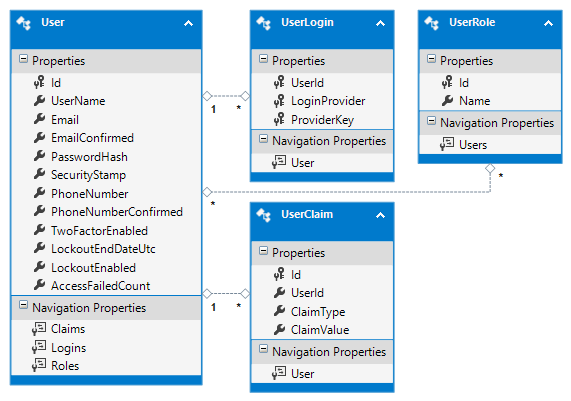
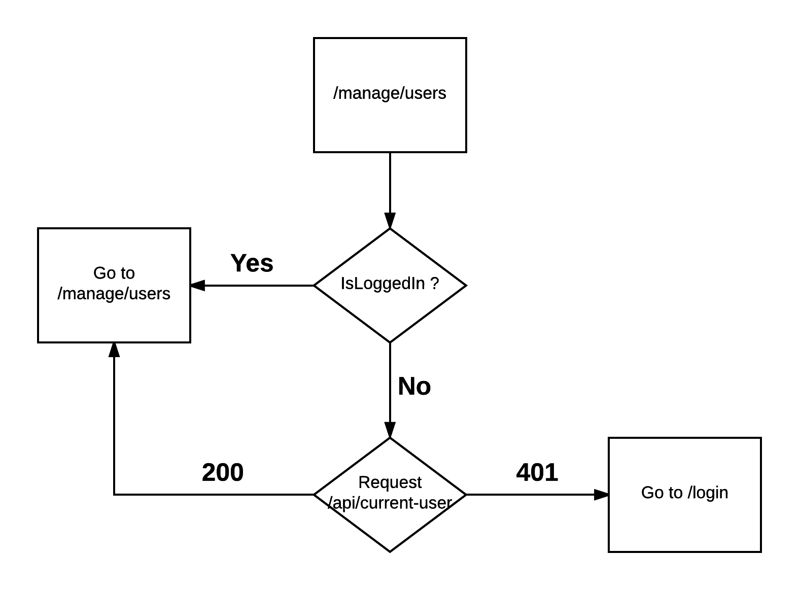

# Abstract 

## Introduction
TODO: 

- describe the motivativation for building this project 
- describe the three diffrent roles

## Goal
The purpose of this thesis is to construct a multi tier web application for automating processes of a gym and provide the following functionality:

1. Ability to login/logout users.
    - Users will be able to stay logged for longer periods of time by using a "remember me" option
    - Future work can have a FB/Google/Microsoft login.
2. Ability to register a user.
    - Future work will require the user to confirm his email.
3. Have three different roles to distinguish users - Admin, Instructor and Student
4. Ability to manage users (Admin)
5. Ability to sell items - goods & cards (Admin, Teacher)
6. Ability to track validity of cards (Admin, Teacher)
7. Ability to view past visits and how much visits a student has left (Admin, Teacher, Student)
    - Student will be able to view only his own visits
    - Admin & Teacher will be able to check-in a user when he has completed his training.
    - Future work may have a bar code/card reader that is integrated to work with the system.
8. Ability to view the week program and reserve a spot

## Practical applications

The main advantage of this project is that it is entirely web-based and requires no installation on local computers. Users will be intuitively guided through the interface and thus not required to enter the data onto plain sheets of paper. Owners(Admin) tracks this information in a central place and not have to resort to constantly require reports from their Employees(Teachers). The system will is implemented with validation and proper error handling in mind. It as well exposes limited functionality based on the current role of the user. The users of the an application may be all kinds of studios, who wish to digitize their business.

Future work may even expand the project to house not only a single studio, but multiple studios. Each studio will be able to manage it's own users and track user statistics.

## Contributions
The above mentioned web application has been successfully build by leveraging on the capabilities of Angular2 and Asp.net Core and was later successfully tested in a live scenario of a yoga studio, where the users were able to track their visits online.

## Previous work

## Technologies (client)

### SPA applications
[SPA][1] stands for single page application and is a technique used for building web applications. It is a commonly used and widespread method that is beginning to outshine the traditional server side rendering frameworks like Asp.Net or JSP.

In a SPA app all the resources, required to load the page are either retrieved on the first page load or are lazy loaded. Lazy-loading means that resources are loaded on demand when needed. This is the preferable method as this way the resources that are required for the initial page load are smaller. This helps for faster loading of resources and improves the overall performance of the web app not only on startup, but during the whole life-cycle of the application. Resources are retrieved in small optimized chunks from the server and can vary in size and content. For instance, a resource can contain JavaScript logic for customizing the UI elements` behavior or it can contain .html file templates for data-binding to data. Such resources may even contain a mix of the latter two resource types combined into a "bundle". Using this approach, a module loader framework such as [webpack][2] is required to help retrieve the files from the bundle. One of the differences between SPA apps and other frameworks such as MVC is that at no time does the client go to the server to do a full page render. Resources are retrieved, modified and consumed by the client framework. This helps achieve a seamless transition between the different sections of the site.

Another significant difference is that all of the UI logic happens on the client. The server is unaware of the client and knows only how to provide the data to it (provided that the current user has permission to access it). The benefit of this approach is that this solution is scalable and loosely coupled. It's scalable, because whenever the load increases the servers can be increased to handle more client requests. It's loosely coupled because the UI can connect to any of the servers that provide the needed APIs.  

All of the data is retrieved via web services using the http protocol. The data is in the form of JSON as it is lightweight data structure and can be consumed by a wide variety of clients including JavaScript clients like browsers. 
The responsibilities of the server consist of serving the data via web APIs and a the HTTP REST protocol.

Building a  SPA app requires a framework that can manage all of the data-binding, navigation, security restrictions and user interaction. The two most popular frameworks that are mostly adopted by the community and have support for building large enterprise applications are [Angular2][5] and [React][6]. These frameworks are build from start with performance and memory management in consideration. For instance, Angular2 supports Ahead of time compilation (AOT) of html templates. For this project Angular2 will be used as it has a larger community build around it and is a rewrite from AngularJS (the v1 version of the framework). Using Angular is preferable, because it was build from scratch to address all of the issues the v1 (AngularJS) version had.

### Angular2
[Angular2][5] is a modern framework for building scalable, testable, memory and CPU performing client web applications. It's official release data was on 15.09.2016 and is relatively stable for use. It provides the necessary functionalities which can be used to quickly build a web application, some of which are described bellow.

#### Data binding
Since the data and html are separated, there needs to be a mechanism for providing the data to the templates, so they can be populated with data. Angular provides declarative data binding with the html template syntax, that lets developers use directives and curly braces or even write JavaScript code in the templates.

#### Routing
The browser is a familiar model of application navigation. We enter a URL in the address bar and the browser navigates to a corresponding page. We click links on the page and the browser navigates to a new page. We click the browser's back and forward buttons and the browser navigates backward and forward through the history of pages we've seen.

The Angular Router ("the router") borrows from this model. It can interpret a browser URL as an instruction to navigate to a client-side page and pass optional parameters along to the supporting page to help it decide what specific content to present. We can bind the router to links on a page and it will navigate to the appropriate application view when the user clicks a link. We can even navigate imperatively when the user clicks a button, selects from a drop box, or in response to some other stimulus from any source. And the router logs activity in the browser's history journal so the back and forward buttons work as well.

Routing enables the user to navigate to different parts of the app, without doing a full page reload. Behind each route lies an entry [component][7] that renders the html output on the browser. This component may be composed of child components, which may have child components of their own. This way a component tree structure is build that in the end outputs html to the browser.

#### Modularity
Angular Modules help organize an application into cohesive blocks of functionality. They aim to group components, directives, pipes and services with similar or dependent functionality. Each is focused on a feature area, application business domain, workflow, or common collection of utilities. Modules can also add services to the application. Such services might be internally-developed such as the application logger. They can come from outside sources such as the Angular router and Http client. Modules can be loaded eagerly when the application starts. They can also be lazy loaded asynchronously by the router.

### NPM
Client-side web applications are usually made using the standard approach with writing the js logic in scripts (or using third-party libraries) and including them in some of the pages that require them. The dependency management of such dependencies can be difficult and error prone. Moreover, it's not easily maintainable. Systems that require external dependencies are using packages-manager systems to help with the management of such dependencies. Examples of such systems are - apt-get (Linux), nuget (.NET). For client-side applications this is [NPM][8]. NPM will be used for the development of the library as it supports both dev dependencies and application dependencies.

### Typescript
JavaScript is the language of choice for writing the client-side logic of web applications. However it lacks type support and the security that languages such as C# and Java offer. [Typescript][9] is a superset of JavaScript and provides types and OOP to JavaScript. Its very similar to C# and makes use of interfaces and abstract classes. Everything is then compile-time checked, before being transpiled to JavaScript. Moreover the transpiled JavaScript is optimized and validated. The community around the project is very large and has helped to develop a very good tool to writing large enterprise web applications.

### Webpack
Client-side applications must be fast and small in size. With eternal dependencies this gets difficult to achieve as most of them come pre-bundled and cannot be shrunk. [Webpack][2] takes care of this by traversing through the required and using the method 'tree-shaking' excludes the code that is not needed. It can be integrated with typescript to provide minification and bundling of the client-side code.

### Kendo grid
There are third-party components that provide a grid view. The benefit of using such components is that they have some functionality that is very usefull - filtering, sorting and pagination[ref] of data. One such component is the [kendo grid component][13]. It is rich in functionality and can be reused in several views of this application.

TODO:
Server side
Asp.net Core
EntitiyFramework core
Asp.net Web api

## State management

## Diagnostics

Error handling - client & server

## Security
As this application requires working with sensitive data, there must be some restrictions placed on the users not to access different parts of the applications thus restricting their access. Therefore the application houses functionalities that prevent users from tampering with restricted data such as Data and View access restrictions. Furthermore the security concept is split into two parts - Authentication and Authorization.

### User model
Asp.net Core provides an out of the box identity management library named [Microsoft Identify v3][10]. The library has integration with [EntityFramework Core][11] and has the ability to automatically set up the database schema for roles and users. The library provides functionality such as managing users, roles, custom claims and even two factor authentication. Moreover, this library can plug into the Asp.net Core request pipeline and automatically login users based on the cookies that they provide. another big advantage is that it is very well tested.

### User management
In order to manage the users and their roles, an interface is needed where the Admin(s) can have the ability to change user access or resolve user conflicts. For instance - assign a role to a user or delete a user. The functionality of the grid is limited to changing the roles of users, adding, deleting and browsing users. 

This functionality is restricted to the Admin role only. Additionally the current admin that is editing the users is not able to see himself in the grid so that he cannot delete himself.

## Authentication
With authentication a user can be recognized as an existing registered user. The user has already passed through the registration process (which may even include email confirmation) and the system can confirm that he is a valid user. If the system does not find such a user present, all requests coming from this user will return with a status code of 401 (Unauthorized).

There are only two publicly visible server endpoints - /login and /register. Every other endpoint requires the user to be authenticated. On the client there are only two routes that the user can access - /login and /register. They have the same name as the corresponding server endpoints that they communicate with for the same purpose. These routes need to be available to anonymous users, so that they can register and login.

### Login
Users are able to login to the system using the login interface, located at the "/login" route. The user is able to enter an email and password and attempts to authenticate with the system. If the user provides invalid credentials then the server should respond with a status code of 400 (Bad request) and optionally return a response message that something is wrong with either the username or password, but not specifying which. By limiting the error information, hacker bots will be more troubled to guess the exact combination required for a successful login. The login screen requires a valid email to be entered using a regular expression to match the valid sequence of characters.

Users can check the "keep me logged in checkbox" when logging in the system. This checkbox instructs the server to issue a "session" cookie that lives even when the browser is closed. This way, when opening the browser again in the future ,this cookie may still be valid and can be reused for authentication. However, the cookie has an expiration date to limit it's lifetime.

The client application keeps track of the state of the current user (whether the user is logged in). Upon a successful authentication, a flag is set to true indicating the success. This flag is checked on every route request to the client application. It is set to false when the cookie expires or the user initiates a logout(here the whole user state is destroyed).

Upon the first request when the client application loads, the app does a "sniffing" call to check if the user is logged in by requesting the user's meta-data from the server. This sniffing call sends the cookie data with it. The sending of the cookie happens automatically and is performed by the browser. If the cookie is not present or it has expired, the response of the status code of this service call is 401. This automatically redirects the user to the login screen. Every request that returns with a status code of 401, automatically redirects the user to the /login route and presents a challenge (in the form of username and password prompt).

The /login route is used as the default route to which the user is navigated if he is not authenticated. This is possible by using route [Guards][3] that are invoked before each route is triggered. This way the app ensures that no unauthenticated user is able to access views that he is not allowed to.

Future development of the application might include Facebook and Google login, which would be a lot easier for the user. He would just need to confirm that the application is a trusted source and he will have an account set-up for him without needing to provide his credentials again. Another feature would be to actually send an email confirmation letter that contains a verification code only for this user. Doing so prevents the system from being flooded by bots.

### Logout
Upon a successful login, the server issues a cookie which identifies the user. The actual data that the cookie contains is encrypted with a [private key][4] and only the server has the ability do decrypt it as he is the owner of the key used for encryption/decryption. This cookie is sent with each request to the server (handled automatically by the browser), so that the server can identify the user and authenticate him without requiring his email and password again.

In order to initiate a "logout", a request to the server endpoint "/logout" must be made which returns a response that instructs the browser to dispose the cookie. This can be achieved through the Logout button that is available as part of every screen of the client side app. Although the logout endpoint requires no parameters, it still requires the HTTP POST verb, as the post verb implies a change on the server - namely logging out the user.

Alternatively the user can directly communicate with the server API by sending an HTTP POST request to /login containing the user credentials.

## Registration
Users may want to register with the system if they do not have an account. This can be achieved by requesting /register or navigating to the register page from the login page. The register screen requires the user to enter data such as an email, password, confirm password and username. All of these input fields are checked on the client side to provide a quick feedback to whether the data that the user entered is valid. This is done using HTML5 and Angular2 validators. The submit button is enabled only when all of the required data is valid. Because not all of the validation can happen on the client, some validation checks need to be performed on the server. Such validation checks include if the username or email is already taken. If one of these is, the server returns a status code of 400 (Bad Request) with a response message indicating the exact problem, so that the app can provide feedback to the user on what went wrong.

Additionally all of the data is further validated on the server, because the user can always bypass the client web application and issue requests directly.

### Future work
Future developments may introduce an ability to block a user or even resend an email conformation if the user was not able to receive it in the first place.

### User meta-data
The meta-data for the current user is retrieved via a /current endpoint that is accessible by every authenticated user. Each time the application starts, this endpoint is requested to check if the user is logged in or not. If the response from the server is 401 (Unauthorized), then the user is redirected to the /login screen. If he is however, he is redirected to the initial requested route.

## Authorization
Authorization limits the rights the user has to specific resources - for instance sensitive data. In order to have a proper Authorization mechanism, the system provides the ability to add specific roles to users. Using this approach on the server, requests are restricted to specific roles and deny access to whomever does not have such. Leveraging the HTTP protocol, all requests coming from a user that doesn't have the proper permissions will have a response of 403 (Forbidden).

In order to guard routes on the client that the user does not have access to, a [Guard][3] will be used to validate the current user. The current user's roles are compared to the one the route allows and if the user does not satisfy the route roles, he is redirected to a 404 page. Another requirement of the system is to have specific portions of html hidden for some roles. This is implemented by using an [angular directive][12] that takes the current user meta-data (roles) and validates it against a predefined set. If the condition is false no html is rendered.

## CORS

The Cross-Origin Resource Sharing (CORS) mechanism gives web servers cross-domain access controls, which enable secure cross-domain data transfers. Modern browsers use CORS in an API container - such as XMLHttpRequest or Fetch - to mitigate risks of cross-origin HTTP requests. By default the site's api will not be accessible from other domains. Thus there will be a specific handler for requests coming from other sites and the server will cut off such requests returning a status code of 400 (Bad Request).

A resource makes a cross-origin HTTP request when it requests a resource from a different domain than the one which the first resource itself serves. For example, an HTML page served from http://domain-a.com makes an  src request for http://domain-b.com/image.jpg. Many pages on the web today load resources like CSS stylesheets, images and scripts from separate domains.

[1]: https://en.wikipedia.org/wiki/Single-page_application "Spa applications"
[2]: https://webpack.github.io "Webpack"
[3]: https://angular.io/docs/ts/latest/guide/router.html#!#can-activate-guard "Angular2 Guards"
[4]: https://www.comodo.com/resources/small-business/digital-certificates2.php "Singing"
[5]: https://angular.io "Angular2"
[6]: https://facebook.github.io/react "React"
[7]: https://angular.io/docs/ts/latest/api/core/index/Component-decorator.html "Angular component"
[8]: https://www.npmjs.com "Npm"
[9]: https://www.typescriptlang.org "Typescript"
[10]: https://github.com/aspnet/Identity "Microsoft identify v3"
[11]: https://docs.microsoft.com/en-us/ef "EF core"
[12]: https://angular.io/docs/ts/latest/guide/attribute-directives.html "Angular directives"
[13]: http://www.telerik.com/kendo-angular-ui/components/grid "Kendo grid"